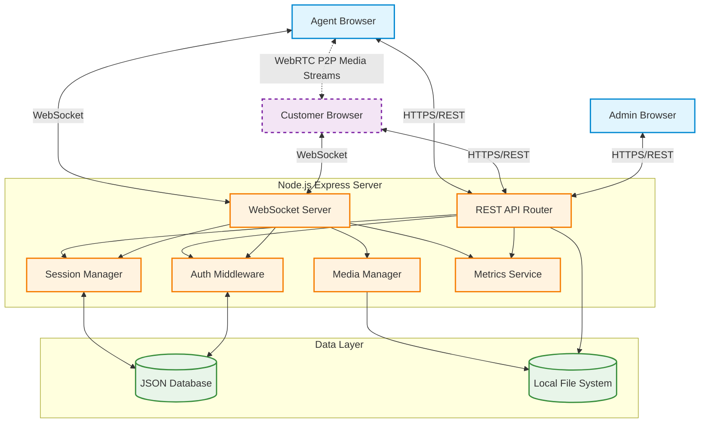

# AtomQuest Video Support Platform Architecture

This document outlines the architecture and system design choices for the platform.

## System Architecture Diagram

## Technology Choices

1. **Frontend (Client)**
   - **React with TypeScript**: Chosen for robust component-based UI development and type safety.
   - **Vite**: Used for fast bundling and hot module replacement during development.
   - **React Router**: For client-side routing (Login, Dashboard, Call Room, etc.).
   - **Vanilla CSS**: Used for styling to ensure full control over the dynamic and modern UI design without the overhead of heavy UI frameworks.

2. **Backend (Server)**
   - **Node.js with Express**: A lightweight and unopinionated framework, ideal for handling REST API endpoints and serving static files.
   - **WebSocket (ws)**: Provides real-time bidirectional communication. Critical for WebRTC signaling (exchanging offers, answers, and ICE candidates) and real-time chat.
   - **JSON Web Tokens (JWT)**: Used for stateless, secure authentication and role-based access control (Agent, Customer, Admin).

3. **Data Storage**
   - **File-based JSON Database**: Chosen to simplify deployment and setup during the hackathon. It provides a lightweight, persistent state mechanism for sessions, users, and chat history without requiring external database instances (like PostgreSQL or MongoDB).
   - **Local File System**: Used for storing uploaded chat files and session recordings.

4. **Media and Communications**
   - **WebRTC**: Used for real-time audio and video. WebRTC enables low-latency communication directly between the Agent and the Customer browsers. 
   - **Signaling Server**: The Node.js WebSocket server acts as the signaling relay, orchestrating the initial connection handshake before the browsers establish the P2P media streams.

5. **Observability**
   - **Prometheus Metrics**: Custom middleware tracking API response times, active WebSocket connections, and application events. Exposed via a standard `/metrics` endpoint to allow seamless integration with monitoring stacks like Prometheus and Grafana.

## Design Patterns & Security
- **Separation of Concerns**: Clean boundaries between HTTP REST controllers, WebSocket event handlers, business logic (`sessionManager`), and data access (`database.ts`).
- **Role-Based Access Control**: Strict validation on the backend ensures Customers cannot trigger Agent-only events (e.g., ending a call or starting a recording).
- **Graceful Reconnection**: The `sessionManager` uses memory-based timers to implement the "grace window" feature. If a WebSocket disconnects, the session state is held as `AGENT_WAITING` until the timer expires or the customer reconnects.
