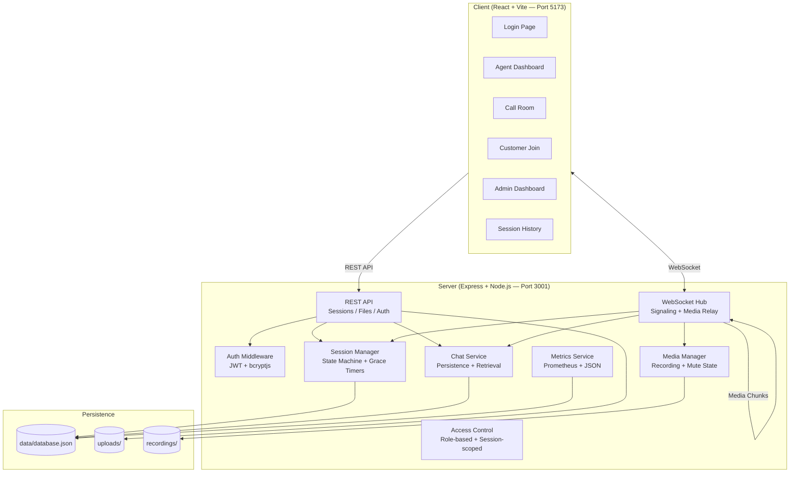

# AtomQuest Video — Real-Time Video Support Platform

A self-hosted, real-time video calling platform for customer support teams. Agents create sessions, invite customers via shareable links, conduct video-assisted support calls with chat, file sharing, and recording — all routed through the server on your own infrastructure.

> **Live Demo:** [https://atomquest-video-platform-3.onrender.com/login](https://atomquest-video-platform-3.onrender.com/login)
---

## 🏗️ System Architecture

### Architecture Diagram



### Media Flow (Server-Routed — No Peer-to-Peer)

```
Agent Browser                    Server                    Customer Browser
     │                            │                              │
     │  MediaRecorder captures    │                              │
     │  video/audio chunks        │                              │
     │ ─── media:chunk (base64) ──▶                              │
     │                            │── media:chunk (relay) ──────▶│
     │                            │                              │ MediaSource API
     │                            │                              │ plays the stream
     │                            │◀── media:chunk (base64) ────│
     │◀── media:chunk (relay) ───│                              │
     │ MediaSource API            │                              │
     │ plays the stream           │                              │
     │                            │                              │
     │      (if recording is ON)  │                              │
     │                            │── writes chunks to ─▶ recordings/*.webm
```

> **Key:** All media is routed through the server using WebSocket. The browser's `MediaRecorder` API captures video/audio chunks, encodes them as base64, and sends them to the server via WebSocket. The server relays these chunks to the other participant AND writes them to disk when recording is active. **There are no direct peer-to-peer connections.**

### Session State Machine

```
CREATED ──(customer joins)──▶ ACTIVE ──(customer disconnects)──▶ AGENT_WAITING
                                 ▲                                      │
                                 │                                      │
                          (customer reconnects                   (grace timeout OR
                           within grace period)                   agent ends session)
                                                                        │
                                                                        ▼
                                                                      ENDED
```

---

## 🧠 Technology Choices & Rationale

| Technology | Why We Chose It |
|-----------|----------------|
| **React 19 + TypeScript** | Modern component-based UI with type safety. React's hooks model is ideal for managing real-time state (WS events, media streams, chat). TypeScript catches API contract mismatches at compile time. |
| **Vite 8** | Fastest dev server with HMR. Instant feedback during development. Zero-config TypeScript/JSX support. |
| **Express 4 + TypeScript** | Mature, minimal HTTP framework. Perfect for REST APIs + easy to integrate with the `ws` library for WebSocket support on the same server. |
| **`ws` (WebSocket library)** | Lightweight, spec-compliant WebSocket server. No overhead of Socket.IO — we need raw control over the signaling protocol and media chunk relay. |
| **MediaRecorder + MediaSource API** | Browser-native APIs for capturing and playing media. MediaRecorder encodes camera/mic into chunks; MediaSource reassembles them for playback. This enables **server-routed media** without any native C++ dependencies. |
| **JSON File Database** | Per hackathon constraints — no external database required. Single-file persistence (`data/database.json`) with auto-save every 5 seconds. Easy to inspect and debug. |
| **JWT (jsonwebtoken)** | Stateless authentication. Tokens carry role + session claims, enabling access control without database lookups on every request. |
| **multer** | Battle-tested multipart file upload middleware for Express. Handles file size limits, MIME type validation, and disk storage. |
| **bcryptjs** | Pure JavaScript bcrypt implementation — no native compilation needed. Secure password hashing for agent/admin accounts. |
| **Vanilla CSS** | No build-time CSS framework overhead. Custom design system with CSS custom properties for theming. Dark mode by default. |

### Why Server-Routed Media (Not Peer-to-Peer)?

The problem statement requires: *"Media must route through a server — direct peer-to-peer connections are not acceptable."*

Our architecture uses `MediaRecorder` → base64 → WebSocket → server relay → `MediaSource`. This means:
- ✅ All media transits through the server (observable, recordable)
- ✅ No native C++ dependencies (no `mediasoup`, no `wrtc` npm package)
- ✅ Works in any modern browser without plugins
- ✅ Server can save media chunks to disk for recording
- ✅ Pure JavaScript — runs on any platform with Node.js

---

## 🚀 Quick Start

### Prerequisites
- **Node.js** v18+ (LTS recommended)
- **npm** v9+
- Modern browser (Chrome, Edge, Firefox)

### 1. Clone & Install

```bash
git clone https://github.com/rdx644/AtomQuest-Video-Platform-.git
cd AtomQuest-Video-Platform-

# Install all dependencies (Client and Server) at once using npm workspaces
npm install
```

### 2. Start the Servers

**Terminal 1 — Server (port 3001):**
```bash
cd server
npm run dev
```

**Terminal 2 — Client (port 5173):**
```bash
cd client
npm run dev
```

### 3. Open in Browser
- **Client:** http://localhost:5173
- **API Health:** http://localhost:3001/api/health
- **Metrics:** http://localhost:3001/metrics

---

## 🎯 Judging Guide — How to Test

### Login Credentials

| Role | Username | Password | What You Can Do |
|------|----------|----------|----------------|
| Agent | `agent1` | `password123` | Create sessions, start/stop recording, end calls |
| Agent | `agent2` | `password123` | Same as above (second agent account) |
| Admin | `admin` | `password123` | Monitor all sessions, force-end, view metrics |

### Testing Agent ↔ Customer Flow (Two Browser Windows)

1. **Window 1 (Agent):** Go to `http://localhost:5173` → Login as `agent1`
2. **Agent Dashboard:** Click **"+ New Session"** → You'll enter the Call Room
3. **Copy Invite:** Go back to Dashboard (or note the session ID) → Click **"🔗 Invite"** to copy the invite link
4. **Window 2 (Customer):** Open the invite link in a **different browser or incognito window** → Enter your name → Click **"Join Video Call"**
5. **Both windows** should now show the call room with:
   - Local video preview
   - Remote participant's video (via server-routed media)
   - Chat panel with file sharing
   - Control buttons (Mic, Video, Rec, End)

### Testing Edge Cases
| Test | How |
|------|-----|
| **Customer disconnect** | Close the customer's browser tab → Agent sees "Customer disconnected" + grace timer starts |
| **Customer reconnect** | Re-open the invite link within 120 seconds → Session resumes automatically |
| **Grace timeout** | Wait 120 seconds after customer disconnect → Session transitions to ENDED |
| **File sharing** | Click "Attach" in chat → Upload an image or PDF → Both sides see it |
| **Recording** | Agent clicks "Rec" → Recording indicator appears → Click "Stop" → File saved to `server/recordings/` |
| **Admin monitoring** | Login as `admin` → See all live sessions → Click "Force End" on any session |
| **Session history** | After a session ends → Click "📋 History" → See events timeline + full chat replay |
| **Duplicate join** | Try opening the same invite in two tabs → Second tab replaces the first (409 on HTTP, 4008 on WS) |
| **Invalid invite** | Navigate to `/join/invalid-token-here` → See "Invalid invite link" error |

---

## 📋 Features

### Must-Have (Section 2)
| # | Feature | Status | Details |
|---|---------|--------|---------|
| 2.1 | Session Management | ✅ | Agent creates session → customer joins via invite token |
| 2.1 | Grace Timeout | ✅ | Configurable timer (default 120s) when customer disconnects |
| 2.1 | State Machine | ✅ | CREATED → ACTIVE → AGENT_WAITING → ENDED |
| 2.2 | Video/Audio Calling | ✅ | Server-routed media relay (MediaRecorder → WebSocket → relay) |
| 2.2 | Mute/Camera Toggle | ✅ | Either participant can mute audio or turn off video at any time |
| 2.3 | Real-time Chat | ✅ | Bidirectional text chat, delivered in real time via WebSocket |
| 2.3 | Chat Persistence | ✅ | Messages persisted to database, retrievable after session ends |
| 2.4 | Role-based Auth | ✅ | JWT with agent/admin/customer roles, enforced on all endpoints |
| 2.4 | Access Control | ✅ | Session-scoped customer tokens, role middleware, invite-only join |

### Good-to-Have (Section 3)
| # | Feature | Status | Details |
|---|---------|--------|---------|
| 3.1 | Call Recording | ✅ | Agent-only start/stop, media chunks saved to `recordings/*.webm` |
| 3.2 | File Sharing in Chat | ✅ | Upload/download in chat (images, PDF, docs, zip — 10MB max) |
| 3.3 | Reconnect Handling | ✅ | WebSocket reconnect with exponential backoff (5 attempts, 15s max) |
| 3.4 | Admin Dashboard | ✅ | Live session monitoring, force-end, session counts, metrics |
| 3.5 | Observability | ✅ | Prometheus `/metrics` endpoint + JSON metrics API for dashboard |

---

## 🔌 API Reference

### Auth
| Method | Endpoint | Auth | Description |
|--------|----------|------|-------------|
| POST | `/api/auth/login` | No | Login with username/password |
| GET | `/api/auth/me` | Yes | Get current user |

### Sessions
| Method | Endpoint | Auth | Description |
|--------|----------|------|-------------|
| POST | `/api/sessions` | Agent/Admin | Create new session |
| GET | `/api/sessions` | Yes | List user's sessions |
| GET | `/api/sessions/live` | Agent/Admin | Get live sessions |
| GET | `/api/sessions/metrics/summary` | Admin | Session metrics |
| POST | `/api/sessions/join/:token` | No | Customer joins via invite |
| GET | `/api/sessions/:id` | Yes | Get session details |
| POST | `/api/sessions/:id/invite` | Agent/Admin | Generate invite link |
| POST | `/api/sessions/:id/end` | Agent/Admin | End session |
| POST | `/api/sessions/:id/force-end` | Admin | Force-end session |
| GET | `/api/sessions/:id/events` | Yes | Get session events |
| GET | `/api/sessions/:id/messages` | Yes | Get chat messages |

### Files
| Method | Endpoint | Auth | Description |
|--------|----------|------|-------------|
| POST | `/api/files/upload` | Yes | Upload file (multipart) |
| GET | `/api/files/session/:id` | Yes | List session files |
| GET | `/api/files/:fileId/download` | Yes | Download file |

### Observability
| Method | Endpoint | Auth | Description |
|--------|----------|------|-------------|
| GET | `/api/health` | No | Health check |
| GET | `/metrics` | No | Prometheus-compatible metrics |
| GET | `/api/metrics` | No | JSON metrics for dashboard |

---

## 🔒 WebSocket Events

### Client → Server
| Event | Payload | Description |
|-------|---------|-------------|
| `chat:send` | `{ content, messageType?, fileUrl? }` | Send chat message |
| `call:mute` | `{ kind: 'audio'\|'video', muted }` | Toggle mute |
| `call:end` | `{}` | End session (agent only) |
| `call:leave` | `{}` | Customer leaves (triggers grace timer) |
| `recording:start` | `{}` | Start recording (agent only) |
| `recording:stop` | `{}` | Stop recording (agent only) |
| `media:stream-start` | `{ mimeType }` | Begin media relay stream |
| `media:chunk` | `{ chunk, mimeType, sequence }` | Send base64 media chunk |
| `media:stream-stop` | `{}` | Stop media relay stream |

### Server → Client
| Event | Payload | Description |
|-------|---------|-------------|
| `connected` | `{ userId, participants, isRecording }` | Connection ack |
| `participant_joined` | `{ userId, role, displayName }` | Participant joined |
| `participant_left` | `{ userId, role, displayName }` | Participant left |
| `chat:receive` | `{ id, sender_name, content, ... }` | Chat message |
| `session_ended` | `{}` | Session ended |
| `session_force_ended` | `{}` | Admin force-ended |
| `grace_timeout_expired` | `{ customerName }` | Customer didn't reconnect |
| `recording:started` | `{ startedBy }` | Recording started |
| `recording:stopped` | `{ stoppedBy }` | Recording stopped |
| `media:chunk` | `{ chunk, mimeType, fromUserId }` | Relayed media chunk |
| `call:participantMuted` | `{ userId, kind, muted }` | Mute state changed |
| `connection_replaced` | `{ message }` | Duplicate connection replaced |
| `error` | `{ message }` | Error message |

---

## 🧱 Tech Stack

| Layer | Technology | Purpose |
|-------|-----------|---------|
| Frontend | React 19 + TypeScript | UI components |
| Build | Vite 8 | Dev server, HMR, bundling |
| Routing | React Router v7 | Client-side routing |
| Styling | Vanilla CSS | Custom dark theme design system |
| Backend | Express 4 + TypeScript | REST API server |
| Runtime | tsx (watch) | TypeScript execution |
| WebSocket | ws | Real-time communication |
| Auth | jsonwebtoken + bcryptjs | JWT tokens, password hashing |
| File Upload | multer | Multipart file handling |
| Database | JSON file (`data/database.json`) | Persistent storage |
| Media Capture | MediaRecorder API (browser) | Captures video/audio chunks |
| Media Playback | MediaSource API (browser) | Reassembles and plays chunks |
| Media Relay | WebSocket (server-routed) | Relays media between participants |

---

## 📁 Project Structure

```
atomquest-video-platform/
├── server/
│   ├── src/
│   │   ├── index.ts              # Server entry point
│   │   ├── config/index.ts       # Configuration
│   │   ├── database/
│   │   │   ├── index.ts          # JSON file database
│   │   │   └── init.ts           # Seed data
│   │   ├── middleware/auth.ts     # JWT auth + WebSocket auth
│   │   ├── routes/
│   │   │   ├── auth.ts           # Login/me endpoints
│   │   │   ├── sessions.ts       # Session CRUD + join
│   │   │   └── files.ts          # File upload/download
│   │   ├── services/
│   │   │   ├── sessionManager.ts # State machine + grace timers
│   │   │   ├── chatService.ts    # Chat persistence
│   │   │   ├── metricsService.ts # Prometheus + JSON metrics
│   │   │   └── accessControl.ts  # Role-based access
│   │   ├── media/mediaManager.ts # Recording + mute tracking
│   │   └── websocket/handler.ts  # WebSocket + media relay
│   ├── data/database.json        # Persistent JSON database
│   ├── uploads/                  # Uploaded files
│   └── recordings/               # Saved recordings (.webm)
├── client/
│   ├── src/
│   │   ├── main.tsx              # React entry
│   │   ├── App.tsx               # Routing + auth state
│   │   ├── index.css             # Design system (dark theme)
│   │   ├── pages/
│   │   │   ├── Login.tsx         # Agent/admin login
│   │   │   ├── Dashboard.tsx     # Agent session management
│   │   │   ├── CallRoom.tsx      # Video call + chat + media relay
│   │   │   ├── CustomerJoin.tsx  # Customer invite join
│   │   │   ├── AdminDashboard.tsx# Live monitoring + force-end
│   │   │   └── SessionHistory.tsx# Events + chat replay
│   │   └── services/
│   │       ├── api.ts            # REST API client
│   │       └── websocket.ts      # WebSocket client + reconnect
│   └── index.html                # HTML entry
└── README.md
```

---

## 🔧 Configuration

Environment variables (optional — sensible defaults provided):

| Variable | Default | Description |
|----------|---------|-------------|
| `PORT` | `3001` | Server port |
| `JWT_SECRET` | `atomquest-hackathon-secret-key-2024` | JWT signing key |
| `JWT_EXPIRES_IN` | `24h` | Token expiry |
| `CORS_ORIGIN` | `http://localhost:5173` | Client origin |
| `GRACE_TIMEOUT_SECONDS` | `120` | Grace period (seconds) |
| `MAX_FILE_SIZE` | `10485760` | Max upload size (bytes) |

---

## 🧪 Testing

### Manual Test Flow
1. Login as `agent1` → Create Session → Copy Invite Link
2. Open invite link in another browser/incognito → Enter name → Join
3. Both sides should see/hear each other via server-routed media
4. Test chat, file sharing, mute controls, recording toggle
5. Customer disconnects → Agent sees "Customer disconnected" + grace timer
6. Customer rejoins within grace period → Session resumes
7. Agent ends session → Both sides see "Session Ended"
8. Login as `admin` → See live sessions → Force-end capability
9. View Session History → Events timeline + chat replay

---

## 📝 Design Decisions

1. **Server-Routed Media (No P2P):** All video/audio is captured by `MediaRecorder`, encoded as base64 chunks, and relayed through the WebSocket server. This satisfies the requirement that "media must route through a server" and enables server-side recording without any native C++ dependencies.

2. **JSON File Database:** Per hackathon constraints — no external database. Single-file persistence with auto-save every 5 seconds. The `data/database.json` file stores users, sessions, events, chat messages, and file records.

3. **Grace Timeout Pattern:** When a customer disconnects, the session enters `AGENT_WAITING` state with a configurable timer (default 120s). If the customer reconnects within the window, the session resumes to `ACTIVE`. If not, a timeout event fires. The agent can continue to wait or end the session manually.

4. **Session-Scoped Customer Tokens:** Customers get JWT tokens that include the `sessionId` claim — they can only access their specific session. No registration required. This prevents a customer from accessing another customer's session data.

5. **Dual Media Architecture:** The WebSocket handler supports both a base64 media-chunk relay (primary path for server-routed media) and WebRTC signaling relay (for browsers that support it). The server always sees and can record the media traffic.

---

## ⚠️ Known Limitations

1. **Media Latency:** Server-routed media via base64 WebSocket chunks introduces ~200-500ms additional latency compared to direct WebRTC P2P. This is a tradeoff for the "media must route through server" requirement.

2. **Scalability:** The JSON file database and in-memory session/room maps are single-process. For production use, you'd need a proper database (PostgreSQL), Redis for session state, and a message queue for multi-instance WebSocket coordination.

3. **Recording Format:** Recordings are saved as raw `.webm` chunks appended to a file. The resulting file is playable but may have minor seek issues since it's an append-only stream without proper WebM finalization.

4. **Browser Compatibility:** `MediaRecorder` and `MediaSource` APIs are required. Works reliably in Chrome, Edge, and Firefox. Safari has limited `MediaRecorder` support (may affect media relay quality).

5. **No TURN Server:** NAT traversal is handled by STUN servers for the optional WebRTC signaling path. The primary server-routed media path doesn't need TURN since all traffic flows through the WebSocket server.

6. **Single Session per Customer:** A customer can only be in one session at a time (enforced by session-scoped JWT). Opening the invite in multiple tabs will replace the previous connection.

7. **CORS Wildcard:** Currently set to `origin: '*'` for hackathon flexibility. In production, this should be restricted to the specific client domain.

8. **No HTTPS in Development:** Media capture requires a secure context in production. The dev server runs on HTTP (which browsers allow for `localhost`). For deployment, HTTPS is required.

---

## 📄 License

Built for AtomQuest Hackathon 1.0
